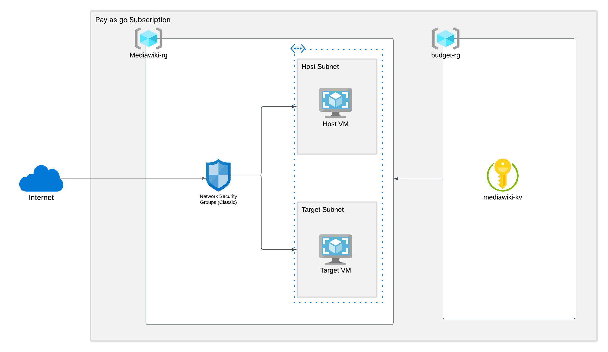
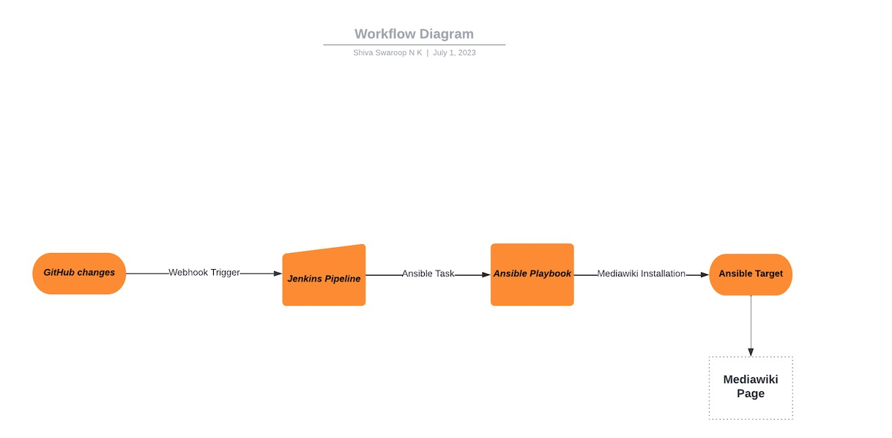

# Assignment Readme File

This document contains an explanation of the assignment's overall flow and the infrastructure's architecture diagram. The following are the screenshots of the same. 

## Architecture Diagram of the infrastructure



Here, we have an Azure subscription (pay-as-you-go). It has 2 resource groups, one existing and one that will be provisioned through the scripts. Key vault resides in the existing resource group while all other resources will be created in the mediawiki-rg. The Network Security Group (nsg) restricts incoming traffic to the virtual machines. In order to install MediaWiki on a Linux server, first provision the resources using the terraform scripts by following the infra setup readme file. Then, in order to set up Ansible, the configuration management tool, follow the steps in the Ansible Installation readme file. Finally, to ensure CI/CD best practices, Jenkins can be installed and set up using the Jenkins Installation readme file. At the end of a successful Jenkins build, the MediaWiki homepage will be accessible on the Target-VM's Public IP.

## Workflow Diagram



Reference readme files
## Infra Setup


## Ansible Setup


## Jenkins Setup


```Public IP of host system not added in tfvars initially to prevent any DDOS attacks```

